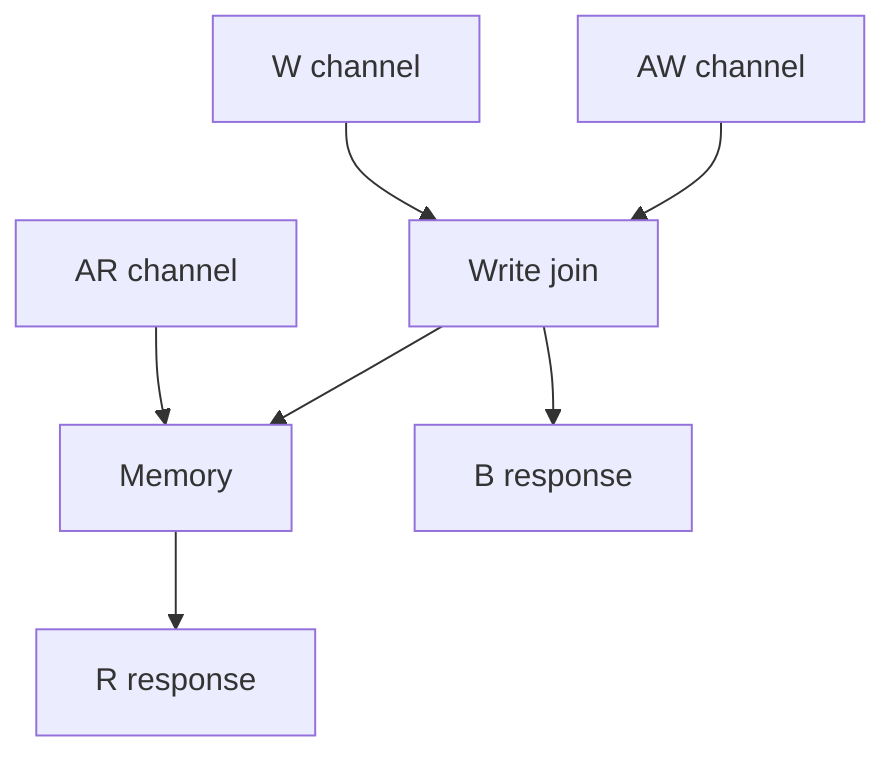

# AXI4-Lite Memory Slave and UVM Verification

A synthesizable AXI4-Lite slave with independent AW/W acceptance, byte strobes, response backpressure, UVM verification, SVA, functional coverage, and an executable Verilator smoke test.

## Channel architecture



AW and W may arrive in any order; the slave commits only after both handshakes. B and R payloads remain stable under backpressure. See [the specification](docs/specification.md).

## Run

```bash
make uvm
make regress
make lint
make smoke
```

The portable test exercises AW/W skew in both directions, delayed BREADY/RREADY, full and partial writes, readback, misalignment, and address decode errors. Success prints `AXI4_LITE_SMOKE_PASS checks=6`.

See [verified results and tool scope](docs/verification_results.md) for the reproducible validation record.

## Verification focus

The most important AXI-Lite trap is assuming AWVALID and WVALID arrive together. They are independent channels. The driver deliberately varies channel order, the monitor joins them independently, and the scoreboard applies `WSTRB` per byte. SVA verifies that every VALID payload stays stable until its READY handshake.

## License

MIT — see [LICENSE](LICENSE).
