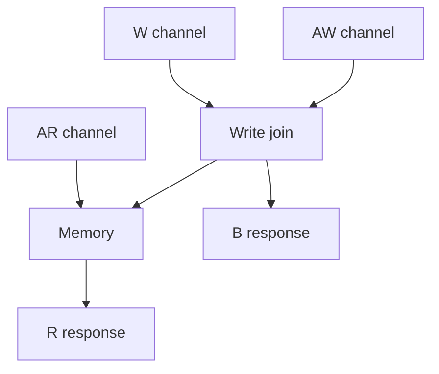
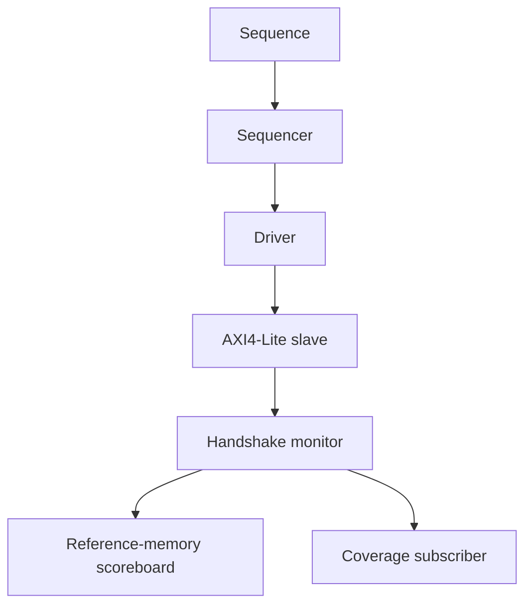

# AXI4-Lite Memory Slave and UVM Verification

[](https://github.com/ashishkommineni/axi4-lite-uvm-verification/actions/workflows/rtl-smoke.yml)

This project implements a small synthesizable AXI4-Lite memory slave and verifies the protocol behavior with UVM, SVA, functional coverage, and a portable self-checking smoke test.

I selected AXI4-Lite because the interface looks simple until the channels are allowed to behave independently. In particular, a write address and its data do not have to arrive in the same cycle. A design or monitor that assumes `AWVALID` and `WVALID` are aligned can pass basic tests and still lose or combine transfers incorrectly.

## Behavioral contract

| Area | Implemented behavior |
|---|---|
| Address space | 64 words × 32 bits; naturally aligned word accesses |
| Write request | AW and W are accepted independently and joined internally |
| Byte update | Each asserted `WSTRB` bit updates one byte lane |
| Read request | One accepted AR request produces one R response |
| Legal response | `OKAY` for aligned in-range accesses |
| Illegal response | `DECERR` for misaligned or out-of-range accesses |
| Backpressure | B and R payloads remain stable while VALID is high and READY is low |
| Outstanding depth | One buffered write and one buffered read response; no IDs or bursts |

The complete assumptions and timing rules are recorded in the [specification](docs/specification.md).

## RTL architecture and flow


```mermaid
flowchart TB
  AW[AW channel] --> J[Write join]
  W[W channel] --> J
  J --> MEM[Memory]
  J --> B[B response]
  AR[AR channel] --> MEM
  MEM --> R[R response]
```

For a write, the slave captures the address handshake and data handshake separately. When both halves are available, it validates the address, applies `WSTRB` byte by byte for a legal access, and creates a B response. The stored response cannot change until `BVALID && BREADY` completes the transfer.

For a read, an AR handshake selects the memory word or an error result. The corresponding data and response are held with `RVALID` until the master accepts them. This stable-payload rule is important because READY may be delayed for any number of cycles.

## UVM data flow


```mermaid
flowchart TD
  SEQ[Sequence] --> SQR[Sequencer]
  SQR --> DRV[Driver]
  DRV --> DUT[AXI4-Lite slave]
  DUT --> MON[Handshake monitor]
  MON --> SB[Reference-memory scoreboard]
  MON --> COV[Coverage subscriber]
```

The driver deliberately changes AW-versus-W order and response-ready delay. The monitor does not copy the driver's transaction. It watches the actual handshakes, joins the observed AW and W halves, and publishes a completed transaction only after the response handshake. That observed transaction updates the scoreboard and coverage model.

The scoreboard keeps an independent byte-addressed memory model. For legal writes, it updates only the selected byte lanes. For reads, it compares DUT data against the model. It also predicts `OKAY` or `DECERR`, so an invalid access must not silently modify the model.

## Verification matrix

| Risk | Stimulus | Checker |
|---|---|---|
| AW and W arrive in either order | AW-first, W-first, same-cycle, and random 0–5 cycle skew | Monitor timestamps plus skew coverage |
| Partial write corrupts untouched bytes | Single-byte, partial, and full `WSTRB` patterns | Per-byte reference-memory update |
| Response changes during backpressure | Delayed `BREADY` and `RREADY` | Five stable-VALID SVA properties |
| Illegal address is accepted as normal | Misaligned and out-of-range traffic | Response prediction and no-write check |
| Read data differs from accepted writes | Directed readback plus randomized traffic | Scoreboard comparison |
| Test ends without useful traffic | End-of-test transaction-count check | Scoreboard `check_phase` |

The full plan, constraints, crosses, and closure conditions are in the [verification plan](docs/verification_plan.md).

## Engineering review notes

The first coverage implementation recorded the delays stored in the generated item. That measured driver intent, not necessarily the order accepted at the interface. I changed the monitor to timestamp the real AW and W handshakes and derive the skew class from those observations. I also restricted strobe and skew coverpoints to write transactions, because sampling them on reads created meaningless bins.

The run scripts use shell `pipefail`, so a simulator or assertion failure cannot be hidden by `tee`. These corrections are recorded in the [verification results](docs/verification_results.md).

## Executed evidence and simulator boundary

The checked portable flow has executed:

- strict RTL lint;
- parameter elaboration at an additional width/depth;
- complete UVM source compile/elaboration against Accellera UVM;
- RTL plus live SVA smoke covering channel skew, partial writes, readback, backpressure, misalignment, and decode errors.

The expected portable PASS token is:

```text
AXI4_LITE_SMOKE_PASS checks=6
```

Xcelium is the intended full-UVM and coverage simulator, but the checked result document does not claim an Xcelium runtime or coverage percentage where no transcript is available.

## Run

Cadence Xcelium/UVM:

```bash
make uvm
make regress
```

Portable Verilator flow:

```bash
make lint
make smoke
```

## Repository map

```text
rtl/                    synthesizable AXI4-Lite slave
tb/interfaces/          AXI signal bundle and clocking blocks
tb/pkg/                 UVM item, agent, scoreboard, coverage, sequence, test
tb/assertions/          protocol properties and cover properties
tb/smoke/               portable self-checking test
tb/top/                 DUT and UVM top-level integration
docs/                   specification, verification plan, and result record
sim/                    deterministic compile order
```

## Interview takeaway

In simple terms, AXI4-Lite uses independent channels even though it supports only single-beat transfers. The key write-side design decision is to buffer the address and data independently, join them only after both handshakes, and hold the response stable under backpressure. In verification, I reconstruct the transaction from interface handshakes instead of trusting the sequence item. The scoreboard applies each `WSTRB` lane to an independent memory model, while assertions continuously check that VALID and its payload stay stable until READY. The most common trap is assuming AW and W always arrive together.

## Scope

This is an educational single-outstanding AXI4-Lite slave, not production interconnect IP. It does not implement bursts, IDs, multiple outstanding transactions, QoS, protection policy, or formal protocol sign-off.

## License

MIT — see [LICENSE](LICENSE).
